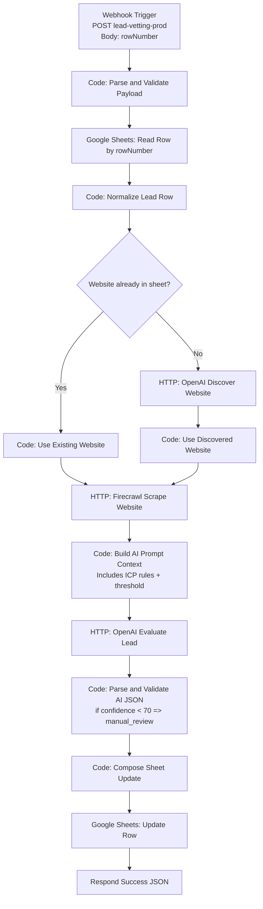

# n8n Lead Vetting Flowchart

## Mermaid Flowchart

## Simple Text Version

1. Receive `rowNumber`.
2. Validate it.
3. Read that exact row from `Leads`.
4. Normalize row fields.
5. If website missing, ask OpenAI to find one.
6. Scrape website with Firecrawl.
7. Send lead + scraped content to OpenAI for fit scoring.
8. Validate JSON result.
9. Force manual review if confidence below 70.
10. Write results back to same row.
11. Return success response.
